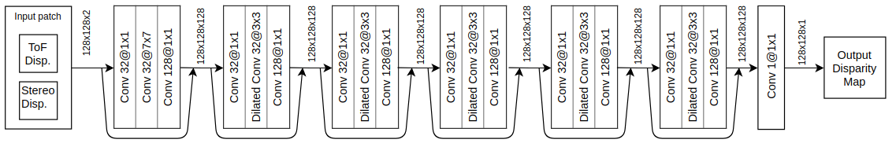
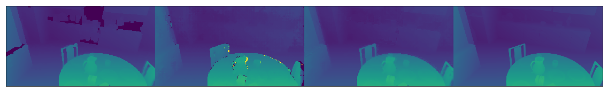
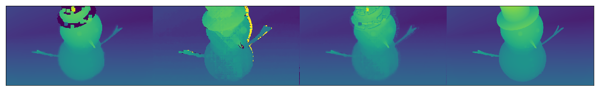
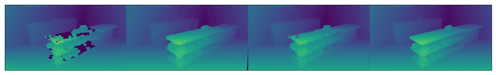

# ToF-Stereo Sensor Fusion
This is a project for a direct sensor fusion of two range imaging cameras:
- A stereo vision system
- A Time-of-Flight range imaging camera

# How is it done
A convolutional neural network was designed and trained for the sensor fusion process. The model was developed in keras on Tensorflow backend

# The CNN architecture

The CNN used for this work consists of a residual neural network with dilated convolutions. As a result of some experiments, these architectural designs have shown a positive impact on the model's performances.

# Some results
In the following pictures some experimental results are shown. Column 1 and 2 represents ToF and Stereo inputs respectively. Column 3 represents the network's output. Column 4 represents the ground truth data.

